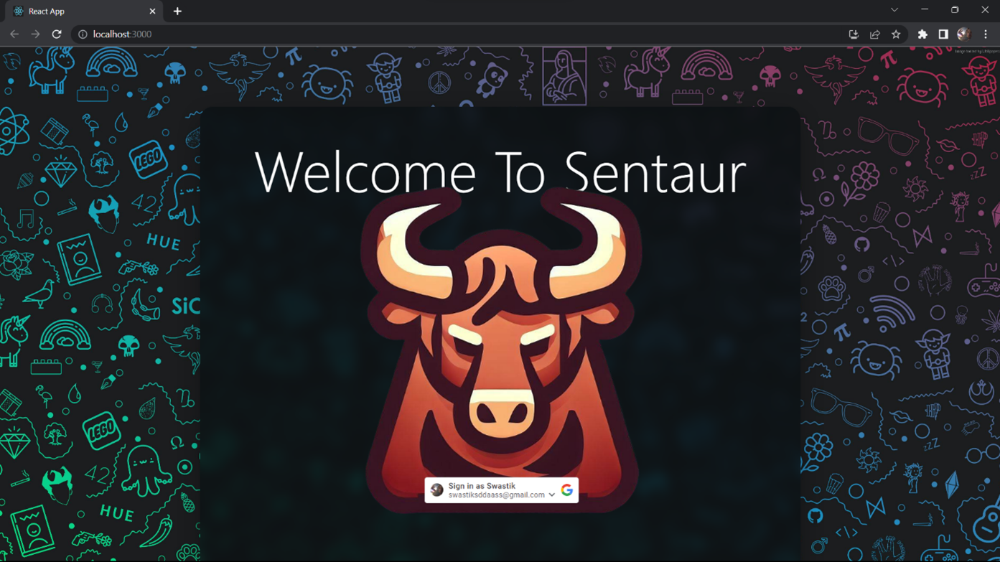
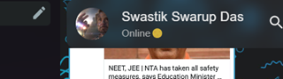
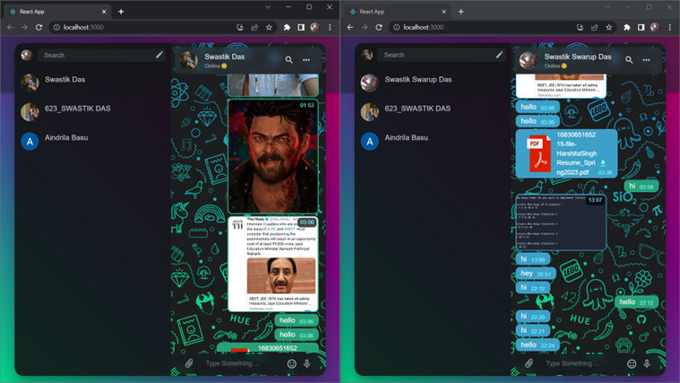
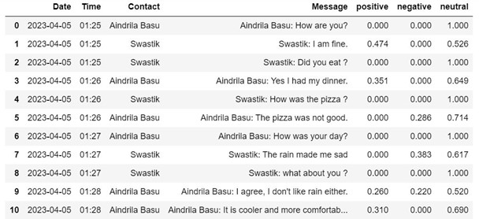

<!-- PROJECT LOGO -->
 

  

  <h3 align="center">Sentaur App</h3>

  

    Sentiment driven leads generator
     

<!-- ABOUT THE PROJECT -->
## About The Project

 

Sentaur is a web-based application that will be used by people interested in using sentiment analysis to determine motivations and purpose of chat participants. The application will be most useful for the deployment of advertisement personalization within applications with real-time analysis of sentiments and user-needs.

Messaging or chat applications have become an important part of our daily lives. But there is still a need for additional features and functionalities. This project aims to fill this gap by providing a chat application along with sentiment analysis to provide users with information about emotions conveyed in their messages. The chat application that we have developed has been named “Sentaur”.

Analysis the texts and assigning a sentiment score to each text will help users understand the tone of the conversation and will help them convey their messages more effectively.

The MERN stack which is used to develop this application is ideal for building modern web applications, Socket.io is used for real time, bidirectional communication between the users, while Python libraries such as NLTK can provide useful tools for performing sentiment analysis on texts. The integration of these technologies provides a comprehensive solution for developing a chat application with sentiment analysis.

# Screenshots
## Main Chat Screen 
The Main Chat screen

## Dialogue Box 
A beautifully semi transparent Dialogue Box

## Floating Window
Material Design Inspired UI

## Online Status
Dynamically changing online status indicator using moon emojis 😄

## Resizebility
All the corners line up perfectly even on resizing the window

## Sentiment Analysis
A screenshot of chat analysis on jupyter notebook 

